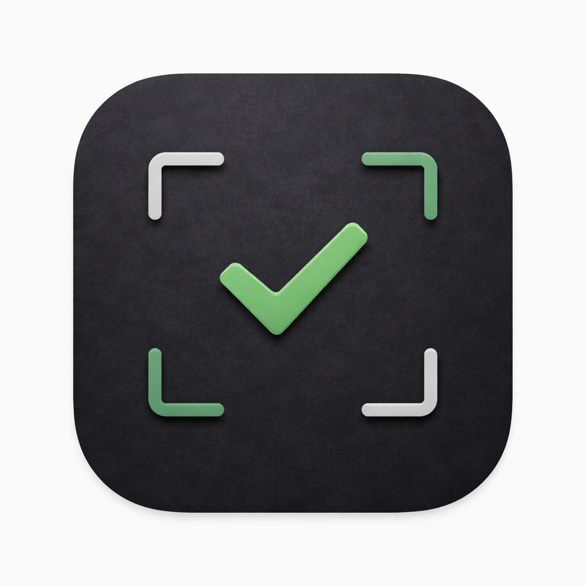

<p align="center">
  
</p>

<h1 align="center">cull</h1>

<p align="center">
  <strong>The fastest way to pick your keepers.</strong><br />
  Browse thousands of RAW photos in under a second. Pick, reject, hand off to Lightroom or Capture One.<br />
  4.5 MB native app. ~3,000 lines of Rust.
</p>

<p align="center">
  <a href="https://www.getcull.fyi">Website</a> &middot;
  <a href="#keyboard-shortcuts">Shortcuts</a> &middot;
  <a href="#lightroom-and-capture-one-integration">LR / C1 Integration</a>
</p>

---

## Why cull?

Every RAW file already contains a full-resolution JPEG preview baked in by your camera. Most software ignores this and decodes the entire RAW file. `cull` extracts these embedded previews directly — no decoding, no rendering pipeline, no waiting.

**No catalog. No import. No subscription.** Point at a folder and go.

### What makes it fast

- **Instant RAW preview** — extracts embedded JPEG previews, no RAW decoding needed
- **Sub-second folder loading** — browse thousands of images the moment you open a folder
- **4.5 MB binary** — smaller than a single RAW file
- **Native Rust + GPU rendering** — not Electron, not a web wrapper

### Professional culling workflow

- **Pick / Reject / Unmark** — keyboard-driven (`P`, `X`, `U`) for rapid image selection
- **XMP sidecar output** — writes industry-standard XMP that Lightroom and Capture One read on import
- **Export picks** — copy selections to a `_picks/` subfolder with one shortcut
- **Send to editor** — open images directly in Lightroom, Capture One, Photoshop, or any editor
- **Grid and loupe views** — filmstrip grid for overview, full-resolution loupe for detail
- **EXIF at a glance** — camera body, lens, focal length, aperture, shutter speed, ISO
- **Camera and lens filters** — filter by body or lens to compare setups

## Supported RAW formats

| Format | Camera |
|---|---|
| CR2, CR3 | Canon |
| NEF | Nikon |
| ARW | Sony |
| RAF | Fujifilm |
| DNG | Adobe, Leica, others |
| ORF | Olympus / OM System |
| RW2 | Panasonic |
| PEF | Pentax |
| SRW | Samsung |
| JPEG | Universal |

## Keyboard shortcuts

| Key | Action |
|---|---|
| `Left` / `Right` | Previous / next image |
| `Up` / `Down` | Previous / next row (grid mode) |
| `P` or `Space` | Pick (mark as keeper) |
| `X` | Reject |
| `U` | Unmark (clear pick/reject) |
| `R` | Rotate 90 CCW |
| `Shift+R` | Rotate 90 CW |
| `Shift+Arrow` | Extend selection |
| `Cmd+click` | Toggle individual selection |
| `Cmd+B` | Toggle file browser |
| `Cmd+E` | Open in external editor |
| `Cmd+Shift+E` | Export picks to `_picks/` |

## Lightroom and Capture One integration

XMP sidecars are written the instant you pick or reject. Import your folder and everything is already tagged.

| Action | XMP written | Lightroom | Capture One |
|---|---|---|---|
| Pick (`P`) | `xmp:Label = "Green"` | Green color label | Green color tag |
| Reject (`X`) | `xmp:Rating = -1`, `xmp:Label = "Red"` | Reject flag + Red label | Red color tag |
| Unmark (`U`) | `xmp:Rating = 0`, no label | Unflagged, no label | No tag |
| Rotate (`R`) | `tiff:Orientation` | Correct rotation on import | Correct rotation |

**Why this mapping:**
- Star ratings (1-5) are untouched — reserved for your own grading within picks
- Lightroom's native Reject flag is `Rating = -1` in XMP — rejects show up correctly
- Green label is the standard visual proxy for picks (LR's Pick flag is catalog-only)

**Workflow:**
1. Open your folder in `cull` — press `P` for keepers, `X` for rejects
2. Import into Lightroom or Capture One
3. Picks have green labels. Rejects are flagged. Stars are at 0 — ready for grading.

## Get cull

**[Download](https://www.getcull.fyi)** a pre-built binary from the website, or build from source:

```
cargo build --release
./target/release/cull
```

## CLI

```
cull                        # Open empty (pick a folder in the UI)
cull ~/Photos/wedding       # Open a specific folder
cull stats ~/Photos/wedding # Show pick/reject/unrated counts
cull picks ~/Photos/wedding # List picked files
cull export ~/Photos/wedding # Copy picks to _picks/
cull mark IMG_001.RAF pick  # Mark a single file
```

When installed from the .app bundle, `cull` is automatically added to your PATH.

## How it works

`cull` extracts embedded JPEG previews from RAW files on background threads — the same previews your camera bakes into every file. EXIF metadata is parsed asynchronously. XMP sidecars are written as simple XML with no library dependencies.

Built with [egui](https://github.com/emilk/egui). The entire application compiles to a single 4.5 MB binary with no runtime dependencies.

## License

MIT
